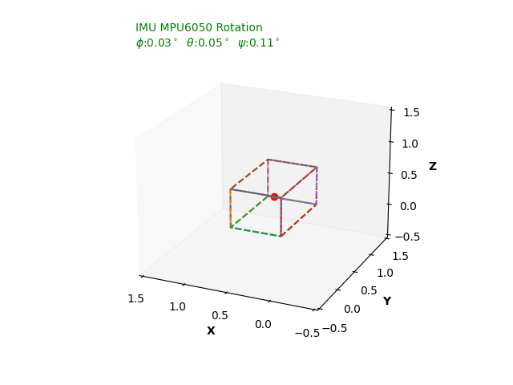

This repo holds the code to read angles reading from MPU-6050 IMU that's connected to a ESP32 Microcontroller. The idea in the program is that, I split the calculation, where I have put angle reading from the sensor in the microcontroller itself, and pass the data through Serial USB communication back to our Python program here in my Laptop. I have fun doing this, real-time data just makes me goes nuts, so viewing the results of reading in another program make me proud of myself. But there is still something wrong with the data flow, but meh will fix it next time.

<p align="center">
  
</p>

## Installation Instructions
First get the libraries that we will be using to read the angles from MPU-6050. I'm using MPU_LIGHT by rfetick. (https://github.com/rfetick/MPU6050_light)

Flash GETAngle_MPULIGHT.iso to the ESP32. Remember the port thou. If no connection, make sure microusb cable is data + power and not power only.

## Running
First clone this repo and then after that flash the .ino code to your ESP32. Finally, Simply run `3dcuberotateanime.py` in your favorite terminal or through VS Code. Or simply just run in in python

```sh
$ git clone https://github.com/WallNutss/imu6050_blocks_viewsanimation.git
$ cd imu6050_blocks_viewsanimation
$ python 3dcuberotateanim.py
```

